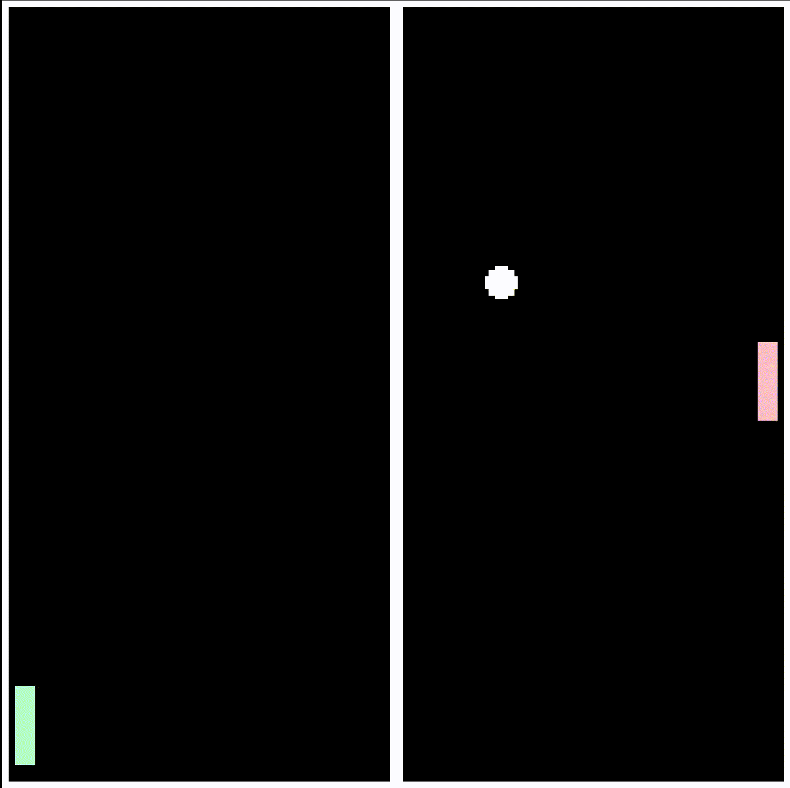

  

<h1 align="center">OKTO</h1>

An 8-bit virtual machine, assembly programming language, and fantasy console for small programs, experiments, and games.

---

## Pong Demo
A complete Pong clone written entirely in **Okto Assembly**.

This example showcases:

- real-time input handling
- collision detection
- ball physics and bouncing
- sprite rendering through the fantasy console
- game loops and state management

It demonstrates how far a compact 8-bit architecture can be pushed while keeping
the entire program small, readable, and close to the hardware.

  
   

> You can run it from `examples/pong.asm`

---

## The Idea

**Okto** is built around a compact 8-bit instruction set where each native
instruction fits in a single byte. Programs are written in Okto assembly,
compiled into a small binary format, and executed by the virtual machine.

The VM exposes a minimal register set, stack-based memory access, pseudo-
instructions for common assembly patterns, and a console interface for graphics,
input, audio, and terminal-style calls.

---

## Documentation

### Assembly

To learn about the Okto assembly language, read:

- [Instructions](/docs/instructions.md): Learn about all native Okto instructions.
- [Pseudo-Instructions](/docs/pseudo-instructions.md): Learn how higher-level assembly commands expand into native instructions.
- [Processors](/docs/processors.md): Learn how `@include`, `@macro`, and `@once` rewrite assembly before parsing.
- [Directives](/docs/directives.md): Learn about `.code`, data sections, and data-producing directives.
- [Instruction Formats](/docs/formats.md): Understand the binary structure used to encode instructions.
- [Registers](/docs/registers.md): Understand the general and special registers used by the VM.

### Memory

To understand how Okto stores and accesses data during execution, read:

- [Memory](/docs/memory.md): Learn about instruction memory, stack memory, and console memory regions.

### Project

Okto currently includes:

- an assembler for Okto assembly files
- a virtual machine for executing compiled programs
- a fantasy console interface
- example programs under [`examples`](/examples)
